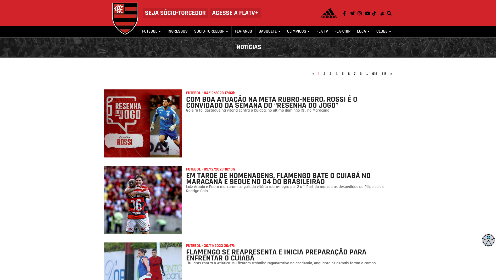

# Mengo News

### Scraping and sending Flamengo news using Golang and Telegram.

# Instructions

1. <a href="https://go.dev/dl/">Download</a> and <a href="https://go.dev/doc/install">install Go</a>

2. Create .env file 
<pre>
  TELEGRAM_TOKEN= "token"
  ID= "chat_id"
</pre>

  

3. Run mengonews.go <pre>go run mengonews.go</pre>

--- 

  
  
  

